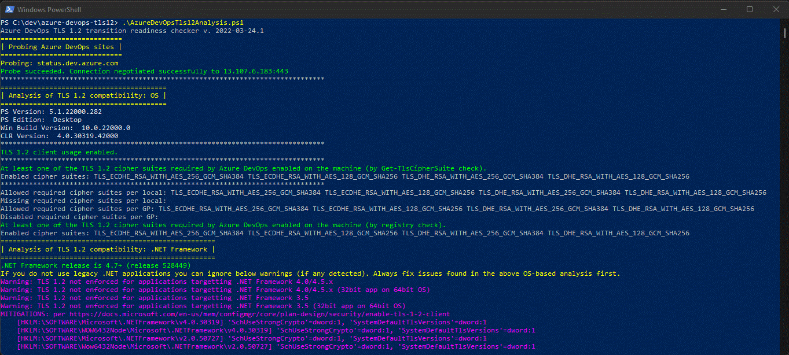
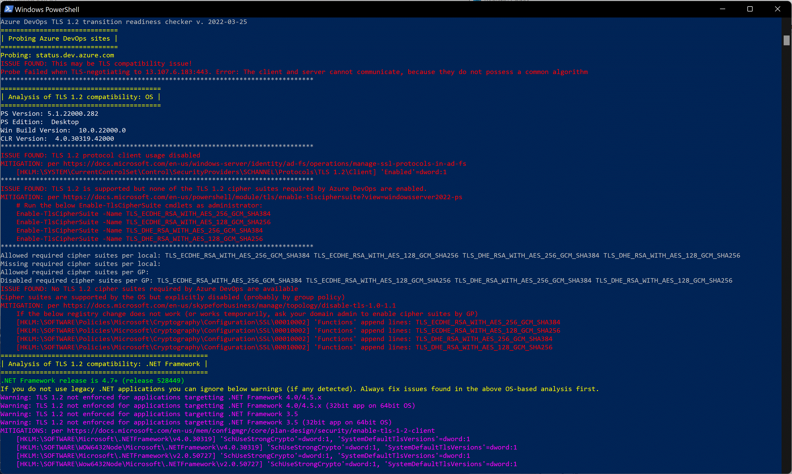

# Azure DevOps TLS 1.2 transition readiness checker

Azure DevOps Services (as many other Microsoft services) is undergoing transition to deprecate transport protocols TLS 1.0, TLS 1.1 and some TLS 1.2 cipher suites which are considered weak.

See announcement from Azure DevOps team here: https://devblogs.microsoft.com/devops/deprecating-weak-cryptographic-standards-tls-1-0-and-1-1-in-azure-devops-services/

The purpose of this project is to simplify the task of preparation for the transition.
We gathered most frequently seen TLS-compatibility issues reported by our customers and made a script which detects them and points the user towards the mitigation.


Run the script:
```ps
AzureDevOpsTls12Analysis.ps1
```
Run in Powershell version 4 or higher. Windows-only, the script has been tested on Windows Server 2012 R2 and above.

What the script does:
- performs a **probe** by opening a test secure connection to https://status.dev.azure.com. This site requires TLS 1.2 & strong cipher suites as will all Azure DevOps sites after the deprecation of TLS 1.0 and 1.1 protocols takes place. 
    - The probe recognizes when the issue is network connectivity or DNS resolving problem vs. when it is caused by TLS incompatibility.         
    - Successfull probe is a proof that the OS allows TLS 1.2 and at least one of the required cipher suites is available. This does *not* guarantee that all other software connecting to Azure DevOps from this computer will work without TLS issues.
- performs an **analysis of OS-level issues** by looking at the selected Windows registry keys which enable/disable TLS 1.2 protocol and influence the set of usable cipher suites. OS-level configuration is shared by all the software which uses HTTPS/TLS stack provided by OS.
- performs an **analysis of .NET Framework**: checks version of .NET framework installed and configuration in Windows registry. 
    - Looks for presence of registry changes which enable .NET apps built against .NET Framework versions prior to 4.7 to leverage TLS capabilities suported by OS. Without these changes, old .NET apps will default to usage of TLS 1.0 even when TLS 1.2 is enabled by the OS.
    - If you don't intend to use legacy .NET programs that communicate over network on the computer, no need to apply these.

What the script does not:
- The script does not execute any mitigations itself. It only prints mitigation advice which consists of URL of docs article and steps to be executed (either cmdlets to call or registry changes to make).
- The script does not need elevated permissions to run.
- The script cannot say if specific app will have TLS issues. There are apps which have TLS/SSL version of choice hard-code or configured.

## Examples

### Case 1



### Case 2




## Contributing

This project welcomes contributions and suggestions.  Most contributions require you to agree to a
Contributor License Agreement (CLA) declaring that you have the right to, and actually do, grant us
the rights to use your contribution. For details, visit https://cla.opensource.microsoft.com.

When you submit a pull request, a CLA bot will automatically determine whether you need to provide
a CLA and decorate the PR appropriately (e.g., status check, comment). Simply follow the instructions
provided by the bot. You will only need to do this once across all repos using our CLA.

This project has adopted the [Microsoft Open Source Code of Conduct](https://opensource.microsoft.com/codeofconduct/).
For more information see the [Code of Conduct FAQ](https://opensource.microsoft.com/codeofconduct/faq/) or
contact [opencode@microsoft.com](mailto:opencode@microsoft.com) with any additional questions or comments.

## Trademarks

This project may contain trademarks or logos for projects, products, or services. Authorized use of Microsoft 
trademarks or logos is subject to and must follow 
[Microsoft's Trademark & Brand Guidelines](https://www.microsoft.com/en-us/legal/intellectualproperty/trademarks/usage/general).
Use of Microsoft trademarks or logos in modified versions of this project must not cause confusion or imply Microsoft sponsorship.
Any use of third-party trademarks or logos are subject to those third-party's policies.
